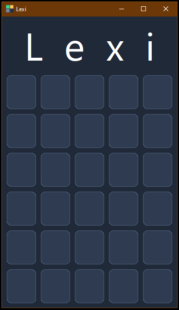

# Lexi

A simple Wordle-inspired word game made with Python and CustomTkinter.


Lexi is a small desktop game where you have a limited number of attempts to guess a hidden word.
Each letter is highlighted depending on whether it is in the right position, in the word, or not in the word.



## ✨ Features

- Wordle-inspired gameplay
- Keyboard controls
- Letter feedback
- Statistics

## 🛠️ Built with

- Python
- CustomTkinter
- JSON

## Setup

Clone the repository:

```bash
git clone https://github.com/IoleStudio/Lexi.git
cd Lexi
python -m venv .venv
.venv\Scripts\activate
pip install -r requirements.txt
python src/main.py```

## 🔮 Future improvements

- Add more animations
- Improve the visual feedback
- Add sound effects
- Add more customization options
- Package the game as a standalone executable

---

Developed by **Iole Studio**

Building desktop applications, websites and custom software.